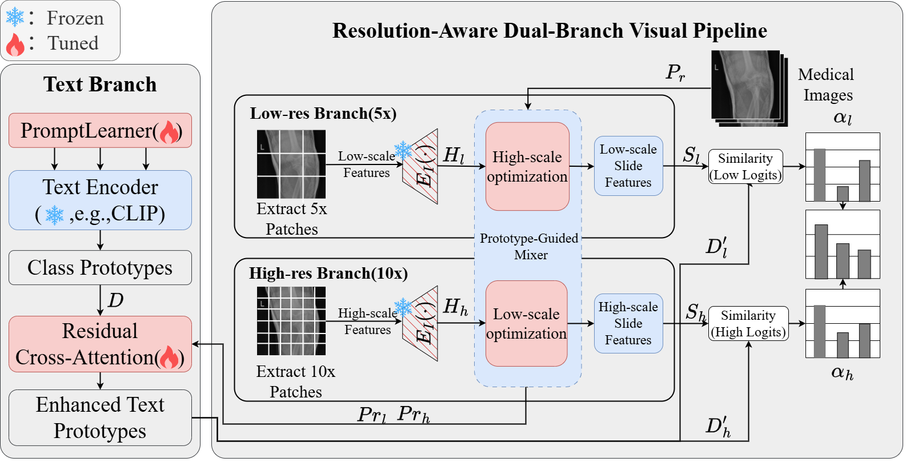

# ViR-MIL
Vision-First Multiple Instance Learning with Scale-Specific Feature Optimization for Radiograph Diagnosis

## 1. Pre-requisites

Python (3.7.7), h5py (2.10.0), matplotlib (3.1.1), numpy (1.18.1), opencv-python (4.1.1), openslide-python (1.1.1), openslide (3.4.1), pandas (1.1.3), pillow (7.0.0), PyTorch (1.6.0), scikit-learn (0.22.1), scipy (1.4.1), tensorboardx (1.9), torchvision (0.7.0), captum (0.2.0), shap (0.35.0), clip (1.0).

## 2. Download Dataset
**MURA (Musculoskeletal Radiographs)** is a large dataset for abnormality detection in musculoskeletal radiographs.

- **Source**: [Stanford ML Group - MURA Competition](https://stanfordmlgroup.github.io/competitions/mura/)
- **Content**: Upper extremity musculoskeletal radiographs labeled as normal or abnormal
- **Body parts**: Shoulder, humerus, elbow, forearm, wrist, hand, finger
  
## 3.Training Command

'''
nohup python main_mura.py \
    --data_root_dir /data/mura/MURAprocessed_data \
    --data_folder_s clip_features_low \
    --data_folder_l clip_features_high \
    --text_prompt_path text_prompt/mura_two_scale_text_prompt.csv \
    --csv_path dataset_csv/mura_abnormality_detection.csv \
    --split_dir splits/task_mura_abnormality_detection_100 \
    --results_dir results/high_branch_optimized \
    --exp_code mura_high_branch_optimized \
    --max_epochs 150 \
    --lr 5e-5 \
    --k 5 \
    --seed 12 \
    --early_stopping \
    --drop_out \
    --prototype_number 24 \
    --bag_loss focal \
    --reg 1e-4 > experiment.log 2>&1 &
'''
